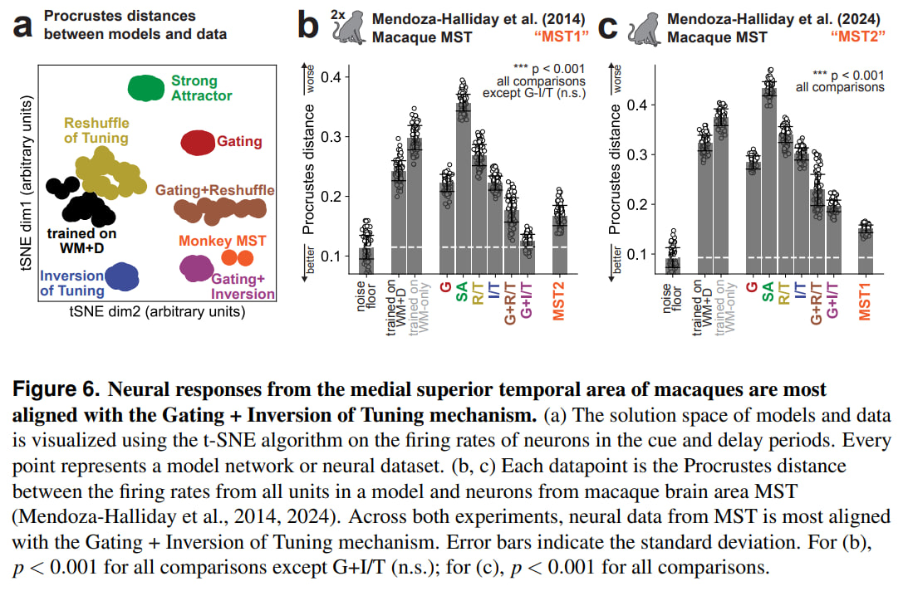

# Overcoming sensory-memory interference in working memory circuits: Code Release
This repository contains the code for reproducing the results from:

**Overcoming sensory-memory interference in working memory circuits**  
Andrii Zahorodnii, Diego Mendoza-Halliday, Julio C. Martinez-Trujillo, Ning Qian, Robert Desimone, Christopher J. Cueva  
bioRxiv 2025.03.17.643652; doi: https://doi.org/10.1101/2025.03.17.643652

To cite this paper, please use:
```bibtex
@article{zahorodnii2025overcoming,
  title={Overcoming sensory-memory interference in working memory circuits},
  author={Zahorodnii, Andrii and Mendoza-Halliday, Diego and Martinez-Trujillo, Julio C. and Qian, Ning and Desimone, Robert and Cueva, Christopher J.},
  journal={bioRxiv},
  pages={2025.03.17.643652},
  year={2025},
  publisher={Cold Spring Harbor Laboratory},
  doi={10.1101/2025.03.17.643652},
  url={https://doi.org/10.1101/2025.03.17.643652},
}
```



## Reproducing Paper Figures

- Please run all the cells from `analysis_interpolation_between_solutions.ipynb` to reproduce Figure 4.
- Please run all the cells from `analysis_procrustes_distance.ipynb` to reproduce Figure 3i, and Figure 6.
- The code for reproducing analyses on example networks from Figure 2, as well as Figure 3e-h is located in the `analysis_example_network_figures.ipynb` notebook.

## Folders

#### the data*/ folders are where individually trained RNNs are saved.
- **data/** folder has a directory for every individually trained RNN, with its own analysis_and_figures.ipynb copy, allowing for analysis and experimenting with that specific RNN.
- **data_json/** folder has saved structural and functional factors for some trained RNNs
- **data_npy/** folder has saved firing rate arrays of trained RNNs, on a bunch of trials
- **data_json_hdreshuffle_and_ratio/** folder has the structural and functional ratios, as well as general information about those networks including the error rate on the task. This is used for the analysis of interpolation between solutions (SA+R/T)

## Files

#### train_*.py files are the files that will train the individual RNNs, according to the parameters passed through command line arguments, and will save the results in the data/* folders.
Name mapping: ("hd" stands for "hand-designed")
- **R/T** = hdreshuffle
- **SA** = hdratio
- **I/T** = hdinversion
- **G** = hdgating
- **backprop** = trained from a random initialization with backpropagation
- **backprop_nodistractor** = trained without the distractor ever present during trial (develops usual ring attractor)
- **backprop_stoptrainingatthreshold** = training proceeds until a certain threshold of performance is reached. Useful for creating non-overtrained backprop RNNs.

#### analysis_*.ipynb files are the ones that analyze the data from the trained RNNs (as well as neural data) and make some of the figures for the paper.