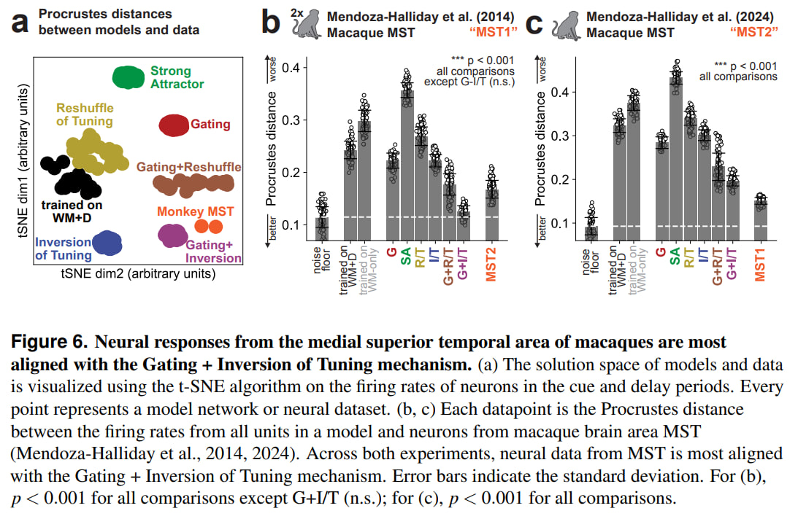

# Overcoming sensory-memory interference in working memory circuits: Code Release
This repository contains the code for reproducing the results from:

**Overcoming sensory-memory interference in working memory circuits**  
Andrii Zahorodnii, Diego Mendoza-Halliday, Julio C. Martinez-Trujillo, Ning Qian, Robert Desimone, Christopher J. Cueva  
bioRxiv 2025.03.17.643652; doi: https://doi.org/10.1101/2025.03.17.643652

To cite this paper, please use:
```bibtex
@article{zahorodnii2025overcoming,
  title={Overcoming sensory-memory interference in working memory circuits},
  author={Zahorodnii, Andrii and Mendoza-Halliday, Diego and Martinez-Trujillo, Julio C. and Qian, Ning and Desimone, Robert and Cueva, Christopher J.},
  journal={bioRxiv},
  pages={2025.03.17.643652},
  year={2025},
  publisher={Cold Spring Harbor Laboratory},
  doi={10.1101/2025.03.17.643652},
  url={https://doi.org/10.1101/2025.03.17.643652},
}
```



## Reproducing Analyses and Paper Figures

### Hardware Requirements

To run the code in this repository, a standard laptop or personal computer will suffice. To re-train all of the RNN networks, we recommend to use a parallelizable compute cluster with 32+ CPU cores (the training procedure can be done on CPU without GPU). For optimal performance when running the code of this repository to reproduce the analysis figures, we recommend the following minimal hardware capabilities:

- RAM: 16+ GB
- CPU: 4+ cores, 3.3+ GHz/core

### Software Requirements

The code in the Python files and Jupyter notebooks has been at various times tested on and should be compatible with Windows 10&11, MacOS and Linux operating systems. This code is compatible with Python versions 3.9-3.11.

To install the necessary requirements and packages, please run the following commands. First, optionally, install a virtual environment with:
```python
python -m venv .venv
source .venv/bin/activate # On Windows: .venv/Scripts/activate
pip install --upgrade pip
```
Then, use `pip` to install the necessary packages to run the code in this repository:
```python
pip install -r requirements.txt
```
Additionally, you will need to install the `netrep` package to compute Procrustes distances from RNNs to neural data and between RNNs. To install the `netrep` package, please follow the instructions on the official [GitHub repository of NetRep](https://github.com/ahwillia/netrep). In short, you will need to run:
```python
git clone https://github.com/ahwillia/netrep
cd netrep/
pip install -e .
```

Installing all of the packages on a normal laptop should take no longer than 30 minutes to 1 hour, and possibly shorter.

### Instructions for reproducing the analyses and paper figures

Tunning all the cells in the specified Jupyter notebooks is expected to run the computational analyses and produce and save the PDF of the figures in the `paper_figures` folder.

- Please run all the cells from `analysis_interpolation_between_solutions.ipynb` to reproduce Figure 4. Running this notebook should take no longer than 30 minutes on a typical laptop.
- Please run all the cells from `analysis_procrustes_distance.ipynb` to reproduce Figure 3i, and Figure 6. Running this notebook should take no longer than 60 minutes on a typical laptop.
- The code for reproducing analyses on example networks from Figure 2, as well as Figure 3e-h is located in the `analysis_example_network_figures.ipynb` notebook. Running this notebook should take no longer than 2 hours on a typical laptop.
- The cells in the notebooks `analysis_neural_2024_intertrial_correlations.ipynb` and `data\hdgating_and_inversionCTRNN_2DIR1O_dr100_n0.1_la0_e1_dp1.0_r1\analysis_and_figures.ipynb` reproduce the intertrial correlation analyses and generate panels for Figure 7.

## Folders

#### the data*/ folders are where individually trained RNNs are saved.
- **data/** folder has a directory for every individually trained RNN, with its own analysis_and_figures.ipynb copy, allowing for analysis and experimenting with that specific RNN.
- **data_json/** folder has saved structural and functional factors for some trained RNNs
- **data_npy/** folder has saved firing rate arrays of trained RNNs, on a bunch of trials
- **data_json_hdreshuffle_and_ratio/** folder has the structural and functional ratios, as well as general information about those networks including the error rate on the task. This is used for the analysis of interpolation between solutions (SA+R/T)

## Files

#### train_*.py files in the `train` folder are the files that will train the individual RNNs, according to the parameters passed through command line arguments, and will save the results in the data/* folders.
Name mapping: ("hd" stands for "hand-designed")
- **R/T** = hdreshuffle
- **SA** = hdratio
- **I/T** = hdinversion
- **G** = hdgating
- **backprop** = trained from a random initialization with backpropagation
- **backprop_nodistractor** = trained without the distractor ever present during trial (develops usual ring attractor)
- **backprop_stoptrainingatthreshold** = training proceeds until a certain threshold of performance is reached. Useful for creating non-overtrained backprop RNNs.

#### analysis_*.ipynb files are the ones that analyze the data from the trained RNNs (as well as neural data) and make some of the figures for the paper.

statistical_testing_utils.py defines some useful functions that are used in the Jupyter notebooks analyzing the macaque neural data.